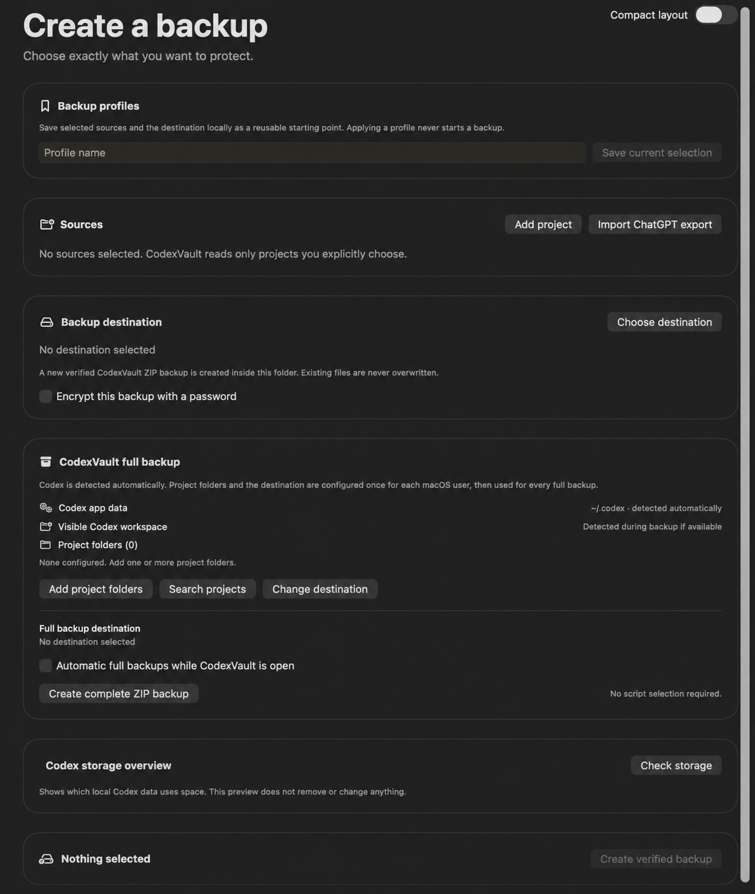
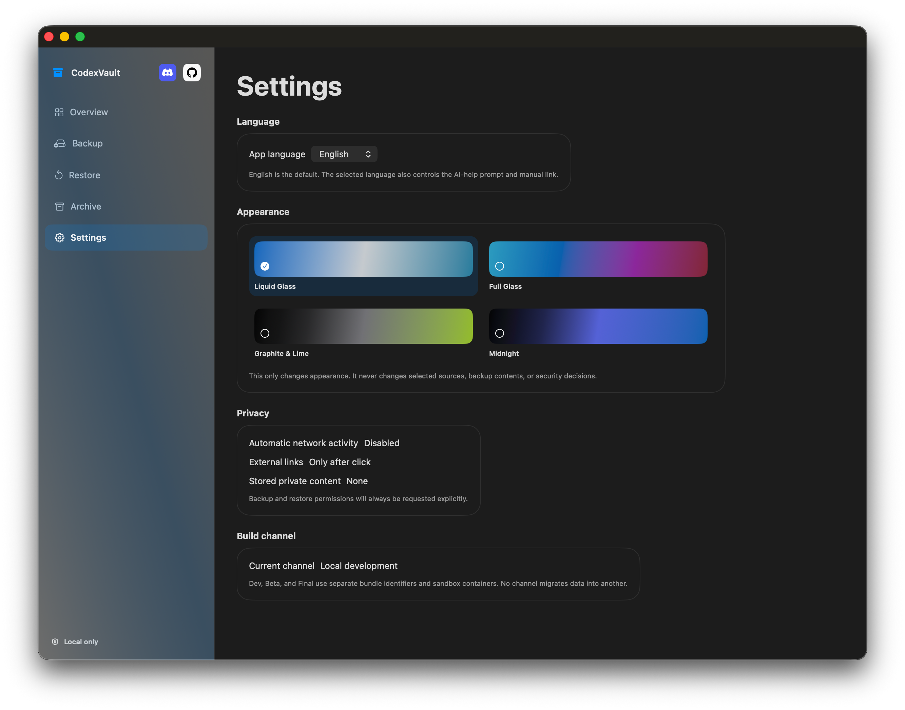

<p align="center">
  
</p>

# CodexVault

[English](README.md)

CodexVault ist eine lokale macOS-App zum Erstellen geprüfter Sicherungen von
ausgewählten Arbeitsordnern und Codex-bezogenen Daten. Die Wiederherstellung
erstellt immer neue Ordner und überschreibt keine vorhandenen Dateien. Es gibt
keinen Upload und keine stillen Backups.

## Funktionen

- Geprüfte ZIP-Backups mit Quellvorschau, Backup-Profilen, Zielprüfung,
  SHA-256-Integritätsprüfung, gezielter Wiederherstellung und Finder-Links.
- Passwortgeschützte normale Backup-Pakete; Passwörter werden nie gespeichert.
- Vollständige lokale ZIP-Backups für Codex-Daten und ausgewählte Projekte mit
  Fortschritt, Prüfung, Aufbewahrung und In-App-Zeitplan mit Uhrzeit.
- Lokale Projektvorschläge und Unterstützung für ChatGPT-Export-Backups.
- Dauerhaftes Archiv mit Finder-, Integritäts- und direkter
  Wiederherstellungsaktion sowie lokaler Codex-Speicherübersicht und optionaler
  kompakter Backup-Ansicht.
- Englische und deutsche Oberfläche, KI-Hilfe und vier Darstellungsvarianten:
  Liquid Glass, Full Glass, Graphite & Lime und Midnight.

## Screenshots

<table>
  <tr>
    <td align="center"><a href="docs/images/overview.png"></a><br><sub>Übersicht und KI-Hilfe</sub></td>
    <td align="center"><a href="docs/images/backup.png"></a><br><sub>Normales Backup</sub></td>
    <td align="center"><a href="docs/images/full-backup.png"></a><br><sub>Erweiterte Backup-Ansicht</sub></td>
  </tr>
  <tr>
    <td align="center"><a href="docs/images/restore.png"></a><br><sub>Wiederherstellung</sub></td>
    <td align="center"><a href="docs/images/archive.png"></a><br><sub>Archiv</sub></td>
    <td align="center"><a href="docs/images/settings.png"></a><br><sub>Einstellungen und Themes</sub></td>
  </tr>
</table>

Eine kompakte Vorschau anklicken, um das datenschutzbereinigte Original in voller Größe zu öffnen.

## Dokumentation

- [Deutsches Handbuch (PDF)](docs/CodexVault-Handbuch-DE.pdf)
- [English manual (PDF)](docs/CodexVault-Manual-EN.pdf)
- [Projektkontext für neue Codex-Chats](PROJECT_CONTEXT.md)
- [Aktuelle Entwicklungsaufgaben](NEXT_STEPS.md)

## Voraussetzungen und lokaler Start

CodexVault benötigt macOS 26. Zum lokalen Starten des Swift Packages werden
Xcode 26.6 oder neuer benötigt:

```zsh
swift run
```

Für lokale Bundles stehen die Skripte in `Scripts/` bereit:

```zsh
Scripts/build-development.sh
Scripts/build-beta.sh
Scripts/build-final.sh
```

Die Skripte bauen ausschließlich lokal und veröffentlichen keine App.

## Gatekeeper-Hinweis für Beta- und Final-Builds

CodexVault-Beta- und -Final-Builds sind bewusst ad-hoc signiert und nicht
notarisiert. macOS kann den ersten Start deshalb blockieren. Die DMG (empfohlen)
oder das ZIP nur aus dem
offiziellen Release laden. Die DMG öffnen, die App auf den enthaltenen Link
**Applications** ziehen und eine dieser einmaligen, nur für diese App geltenden
Freigaben verwenden:

1. Im Finder mit gedrückter Control-Taste auf `CodexVault Beta.app` klicken,
   **Öffnen** wählen und im folgenden Dialog nochmals **Öffnen** wählen.
2. Falls macOS die App weiter blockiert: Die App einmal zu öffnen versuchen,
   dann **Systemeinstellungen > Datenschutz & Sicherheit** öffnen, bis zur
   Sicherheitsmeldung für CodexVault scrollen, **Dennoch öffnen** wählen und
   mit **Öffnen** bestätigen.

Gatekeeper nicht global deaktivieren. Siehe
[Apples Anleitung zum sicheren Öffnen von Apps](https://support.apple.com/102445).
Jede Veröffentlichung enthält einen eigenen Datenschutzbericht mit den
SHA-256-Prüfsummen beider Release-Artefakte.

## Datenschutz und Veröffentlichungen

CodexVault arbeitet lokal. Normale Backups schließen typische Geheimnisse und
Build-Artefakte aus. Vollständige Backups können sensible lokale Codex-Daten
enthalten und gehören deshalb nur in ein vertrauenswürdiges Ziel.

Dev-App-Bundles werden niemals verpackt oder veröffentlicht. Jede separat
beauftragte Beta- oder Final-Veröffentlichung enthält immer DMG (mit
**Applications**-Link), ZIP und einen fertigen Datenschutzbericht mit beiden
SHA-256-Prüfsummen als separaten Release-Anhang. Die Vorlage steht in
[docs/RELEASE_PRIVACY_REPORT_TEMPLATE.md](docs/RELEASE_PRIVACY_REPORT_TEMPLATE.md).

## Lizenz

CodexVault steht unter der [GNU GPL v3.0](LICENSE).
