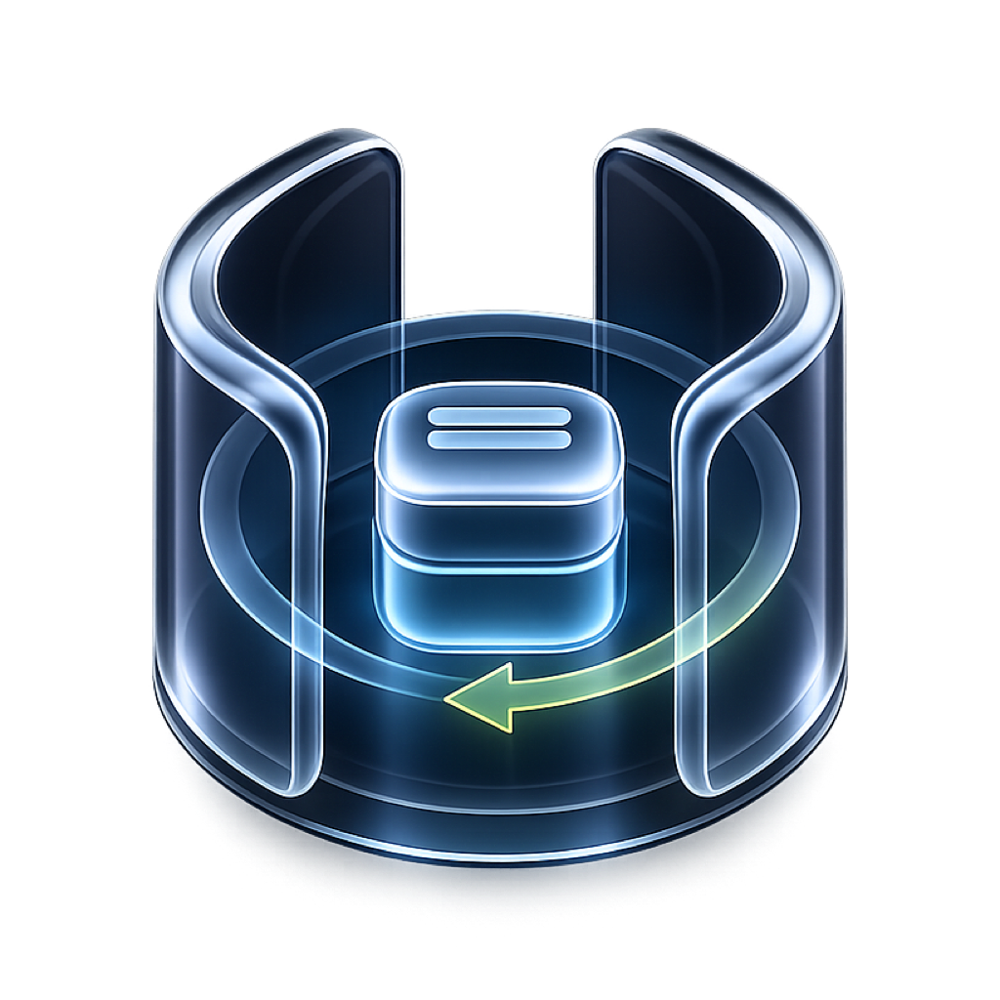
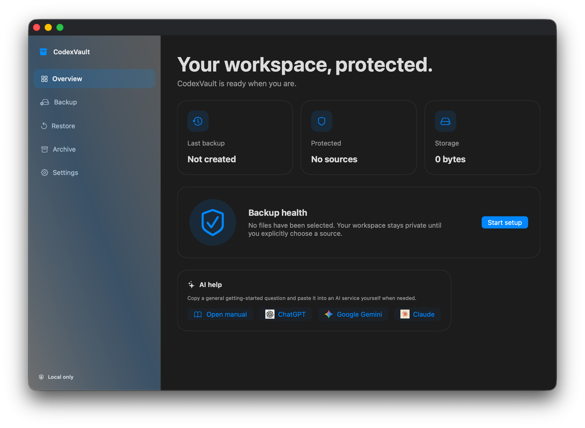
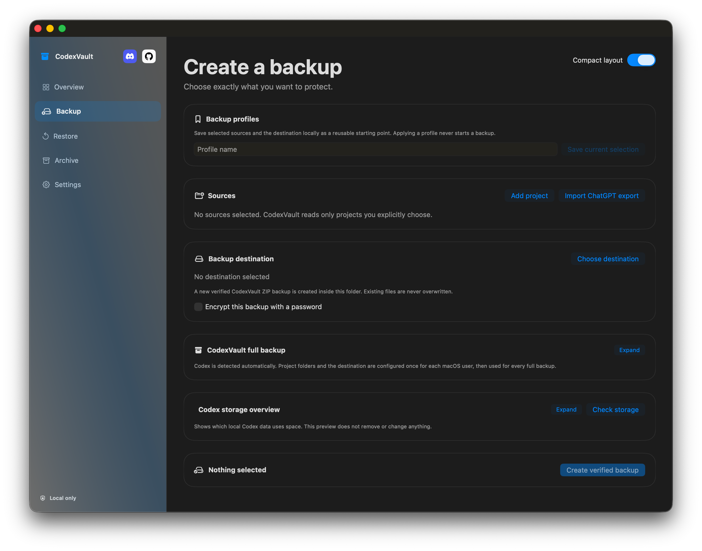
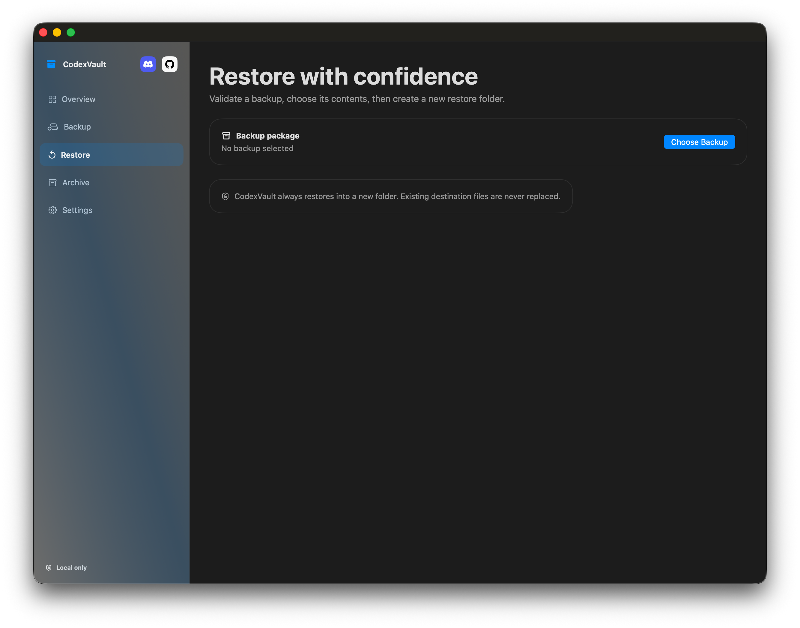
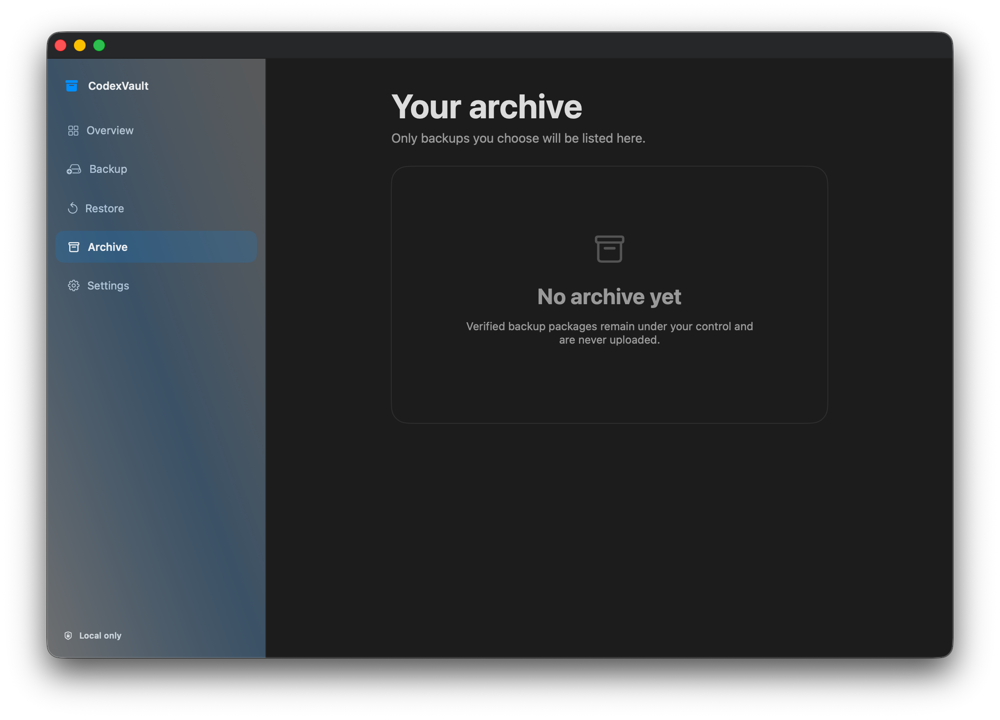

<p align="center">
  
</p>

# CodexVault

[Deutsch](README.de.md) · [English](README.md)

CodexVault is a local macOS app for creating verified backups of selected work
folders and Codex-related data, then restoring them into new folders without
overwriting existing files. It does not upload data or run silent backups.

## Features

Keep this list current whenever an implemented user-facing feature changes.

- Select multiple project and additional folders for a normal backup.
- Preview file count, size, and excluded sensitive files before creating a
  backup.
- Create portable `.codexvault` packages with a manifest and SHA-256 checks.
- Verify a package before restoring selected sources into a new folder.
- Create a complete local ZIP backup of detected Codex data and configured
  project folders, with progress, verification, a dated copy, and a `latest`
  copy.
- Add multiple project folders to a persistent full-backup list and remove an
  individual folder without replacing the other selections.
- Keep the three newest dated complete backups per source after an explicit
  confirmation; the app never removes older backups silently.
- Inspect local Codex storage by category and project assignment, then
  permanently remove only explicitly selected, unassigned local records after
  confirmation.
- Use four appearances: Liquid Glass, Full Glass, Graphite & Lime, and
  Midnight.
- Use English (default) or German for the app interface. The selected language
  also controls the AI-help prompt and the public manual it opens.
- Keep Dev, Beta, and Final builds separate with distinct bundle identifiers
  and data containers.
- Show a first-start welcome screen while no own selection, configuration, or
  backup content exists. The Overview also keeps this AI help available after
  setup: it can open the public manual or copy a general, language-matched help
  question before opening ChatGPT, Google Gemini, or Claude. No app content is
  sent automatically.

## Screenshots

<table>
  <tr>
    <td align="center"><a href="docs/images/overview.png"></a><br><sub>Overview</sub></td>
    <td align="center"><a href="docs/images/backup.png"></a><br><sub>Backup</sub></td>
  </tr>
  <tr>
    <td align="center"><a href="docs/images/restore.png"></a><br><sub>Restore</sub></td>
    <td align="center"><a href="docs/images/archive.png"></a><br><sub>Archive</sub></td>
  </tr>
</table>

Select a preview to open the full-size original.

## Documentation

- [English manual (PDF)](docs/CodexVault-Manual-EN.pdf)
- [Deutsches Handbuch (PDF)](docs/CodexVault-Handbuch-DE.pdf)
- [Project context for new Codex chats](PROJECT_CONTEXT.md)
- [Current development tasks](NEXT_STEPS.md)

## Requirements and local start

CodexVault requires macOS 26. To run the Swift Package locally, use Xcode 26.6
or newer:

```zsh
swift run
```

For local bundles, use the scripts in `Scripts/`:

```zsh
Scripts/build-development.sh
Scripts/build-beta.sh
Scripts/build-final.sh
```

The scripts build locally only. They do not publish an app.

## Gatekeeper notice for Beta 1

[CodexVault 1.0 Beta 1](https://github.com/Schrotty74/CodexVault/releases/tag/v1.0.0-beta.1)
is ad-hoc signed and not notarized yet. macOS may therefore block its first
launch. Download the DMG (recommended) or ZIP only from the official release.
Open the DMG and move the app to Applications, then use one of these one-time,
app-specific approvals:

1. In Finder, Control-click `CodexVault Beta.app`, choose **Open**, then choose
   **Open** again in the confirmation dialog.
2. If macOS still blocks it, try opening the app once, then open **System
   Settings > Privacy & Security**, scroll to the security message for
   CodexVault, select **Open Anyway**, and confirm with **Open**.

Do not disable Gatekeeper globally. See
[Apple's instructions for safely opening apps](https://support.apple.com/102445).
The attached [privacy report](docs/releases/CodexVault-1.0-Beta-1-Privacy-Report.md)
contains the SHA-256 checksums for both release artifacts.

## Privacy and releases

CodexVault works locally. Normal backups exclude typical secrets and build
artifacts. Complete backups can contain sensitive local Codex data and must be
stored only in a trusted destination.

Dev app bundles are never published. Only a separately authorized Beta or Final
release may be published, and each one must include a completed privacy report
as a separate release attachment. See
[the release privacy-report template](docs/RELEASE_PRIVACY_REPORT_TEMPLATE.md).

## License

CodexVault is licensed under the [GNU GPL v3.0](LICENSE).
